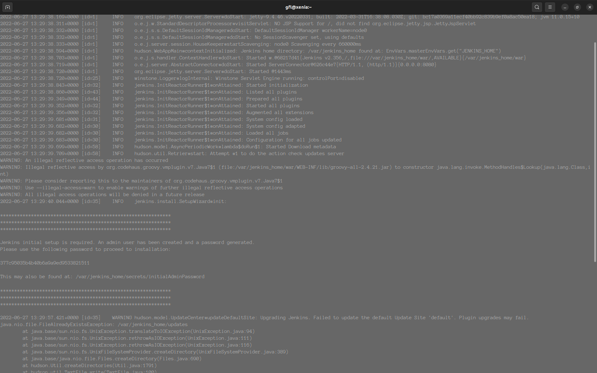

# Connecting to Running Containers

To access a container that is already running, docker priovides ```docker exec``` command

```sh
docker run -it --name apache httpd /bin/bash```
```

After executing it, you will be presented with a prompt inside the container and hostname root@container-id:/path/to/working/directory

- ```-it``` options are required if you want to use an interactive shell
- ```/bin/bash``` es el comando para ejecutar dentro del conteiner. Analogo a la instruccion CMD del Dockerfile
- Se puede utilizar ```dit``` de igual manera

## Connecting to Containers

```sh
docker run -it --name enter_redis redis /bin/bash
bash -version
exit
docker ps -a
# Container status EXITED
```

# Docker Logging

```sh
docker run -dit --name busylogs -p 8080:8080 -p 50000:50000 jenins/jenkins:lts
docker logs busylogs
```

  

- Follow the changes: ```-f```
- Timestamps: ```-t```
  - ```docker logs -t nombrecontainer```
  - ```docker logs -t nombrecontainer --since 2022-01-01```
  - Logs recorded in ```/var/log``` directory

## External Logging

Docker engine creates logs, sends its to the host machine syslog system
    - Linux: /var/log/messages
    - Debian/Ubuntu: /var/log/syslog

## Journal Command

displays the last 20 entries in the logs from all the service on the system

```sh
journalctl -n 20
journalctl -u docker.service -n 20 # Filter for service
journalctl --no-pager -u docker.service -n 20
```